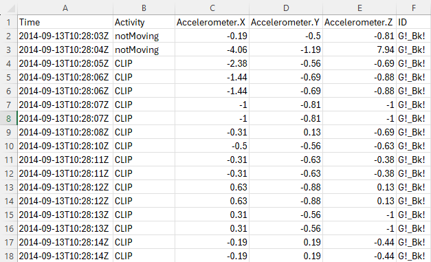
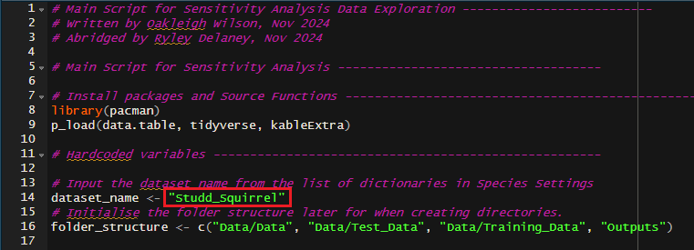
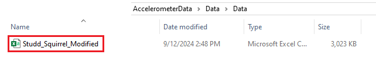
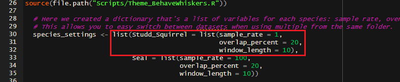

# Accelerometer Behaviour Analysis Report Generator
A HTML report generator of accelerometer data for pre-processing and determining variables for feature generation.
Created by Ryley Delaney February 2025

## Table of Contents  
- [Overview](#overview)
- [Task Description](#task-description)
- [Scripts](#scripts)
- [Packages](#packages)
- [Setup](#setup) 
- [Usage](#usage)
- [Reading the Report](#reading-the-report)
- [References](#references)

## Overview

This Repository contains scripts that allows the user to create a HTML document from accelerometer data that displays various information to help with feature generation. The document contains some preliminary information about the dataset used and a series of plots and tables. It was created as a part of a volunteering project during my undergrad with PhD candidate Oakleigh Wilson at the University of the Sunshine Coast. 

You can view Oakleigh's Github and her work on machine learning and accelerometry <a href="https://github.com/OakAlice"> here </a> 

You can view an example report using Squirrel data from Studd (2019) <a href="Assets/Report_Example.html">here</a>

 The example report is in HTML format and will need to be downloaded to be viewed properly if attempting to view from GitHub.

 

## Task Description

Below is a brief summary of the task outlined to me by

 Animal-borne accelerometers collect high-frequency changes in acceleration, capturing patterns that can be linked to specific fine-scale behaviours. These patterns are used to train machine learning models that can identify what an animal is doing based on its movement. However, training these models requires converting the raw accelerometer data into machine-interpretable statistical 'features.' One key step in generating these features is determining the duration of behaviours that appear in the data.
Using the provided code as a base, please develop an automated reporting system that can take accelerometer data and sample rate as inputs and generate a html report to A) visualise the existing data, and B ) suggest the optimal window length for feature generation. This system should require minimal user input and include clear explanations of how to interpret graphs and tables, as well as a description and reasoning for the ultimate recommendation.

## Scripts
 
<h4> AccelerometerAnalysis_Main.R </h4>
The main script of the repository, loads all packages, sources all functions as well as the GenerateBehaviourReport.Rmd. Part of the script involves seamlessly guiding inputs from the user on including outliers in the Behaviour Duration box plot.
  
<h4> Functions.R </h4>
Contains all the functions that are necessary for AccelerometerAnalysis_Main.R to run.
  
<h4> GenerateBehaviourDurationReport.Rmd </h4>
The R markdown file that calls on the plot generator functions and creates the final HTML report.
  
<h4> Theme_BehaveWhiskers.R </h4>
Contains a basic theme thats used for the Behaviour Generation Report.

 

## Packages
This program uses a few packages which will need to be installed in order to run.
<ul>
<li> <b>pacman</b>
<li> <b>data.table</b>
<li> <b>tidyverse</b>
<li> <b>kableExtra</b>
</ul>

 

## Setup
The Accelerometer Analysis Report generator requires a brief setup of directory structure. All Scripts should be placed in the working directory inside a folder called Scripts.
 
For Example: C:/Users/user/Desktop/AccelerometerData/Scripts
 
When first running the main script it will create a series of directories necessary for the program to work.  
One of these folders will be YourWorkingDirectory/AccelerometerData/Data/Data  
Afterwards the program will prompt for you to place your data into this folder before continuing.

 

#### Your_Data_Modified.csv
The main script will require the data placed in the 'Data/Data' folder to be named and formatted in a certain way.
The data will need to follow the convention of: "<i>Your_Data</i>_Modified.csv" as this is what the program will look for in the data folder.
An example of a correctly formatted data CSV is given below:
  

 
  
    

Note that the data in the example shown has it's columns titled with the following:
<li> <b> Time </b> - The date and time when the individual is sampled.
<li> <b> Activity </b> - the behaviour listed.
<li> <b> Accelerometer.X </b> - The acceleration in the <b>'X'</b> dimension.
<li> <b> Accelerometer.Y </b> - The acceleration in the <b>'Y'</b> dimension.
<li> <b> Accelerometer.Z </b> - The acceleration in the <b>'Z'</b> dimension.
<li> <b> ID </b> - The individual completing the behaviour.
  
It's very important that any data inserted into the program is formatted, case sensitive, this way as otherwise <b> the program will throw an error and not work. </b>

   

## Usage

<h4> Before sourcing: </h4>
Before sourcing the script you will need to enter in the name of the dataset you are using into the <i>'dataset_name'</i> variable.
 
For example: 
 

 
  
    

 
Which will allow the program to look for the file within your directory as shown:

 
  
    

 

You will also need to change or insert an appropriate list of variables into the dictionary for your current dataset:
 
<ul>
<li> <i>sample_rate</i>
<li> <i>overlap_percent</i>
<li> <i>window_length</i>
</ul>
<b>'overlap_percent'</b> and <b>'window_length'</b> were built into the dictionary for uses that build off of this project but are not necessary for report generation.
 
<b>sample_rate</b> refers to the rate of sampling, in seconds, taken by the accelerometer within the dataset.
 
The name of the list needs to be the same as your 'dataset_name' variable.
  
Below is another example:
 

 
  
    

<h4> Sourcing AccelerometerAnalysis_Main.R </h4>

At this point you are ready to source AccelerometerAnalysis_Main.R.

The program will search to see if a report already exists and prompt you whether or not to overwrite it. Afterwards it will prompt the user if they would like to include outliers within the plot. This was because in some data sets, including outliers made some values very difficult to read in the behaviour duration plot.
   

## References
Studd, E. K. <i>et al.</i> Behavioral classification of low-frequency acceleration and temperature data from a free-ranging small mammal. <i>Ecology and Evolution</i> 9, 619–630 (2019).
